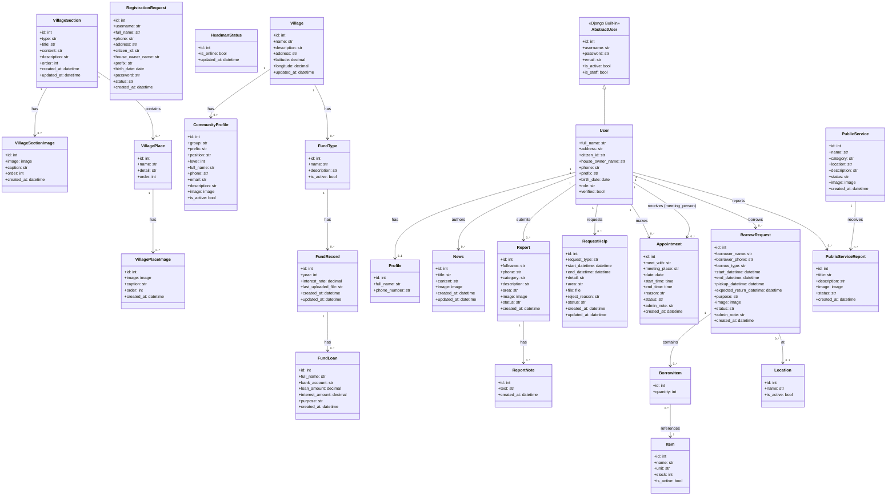

# Class Diagram - ระบบจัดการชุมชน

---

## คำอธิบาย Enum Values

| คลาส | Field | ค่าที่เป็นไปได้ |
|------|-------|----------------|
| `User` | role | guest / user / admin / superadmin |
| `RegistrationRequest` | status | pending / approved / rejected |
| `VillageSection` | type | RICH / PLACES |
| `CommunityProfile` | group | leader / committee / volunteer |
| `Report` | status | pending / processing / resolved / canceled |
| `Report` | category | ไฟฟ้า / น้ำ / ถนน / บุคคล / เสียง / กลิ่น |
| `RequestHelp` | status | pending / approved / rejected / done / canceled |
| `RequestHelp` | request_type | เสียง / ปิดทาง / ทั้งสองอย่าง / อื่นๆ |
| `Appointment` | meet_with | headman / assistant_headman |
| `Appointment` | meeting_place | village_hall / temple / headman_office / learning_center |
| `Appointment` | status | pending / approved / canceled / rejected / done |
| `BorrowRequest` | borrow_type | ITEM / LOCATION |
| `BorrowRequest` | status | pending / approved / borrowed / return_requested / returned / rejected / cancelled |
| `PublicService` | category | water / washer / other |
| `PublicService` | status | normal / maintenance / broken |
| `PublicServiceReport` | status | pending / processing / resolved / canceled |
